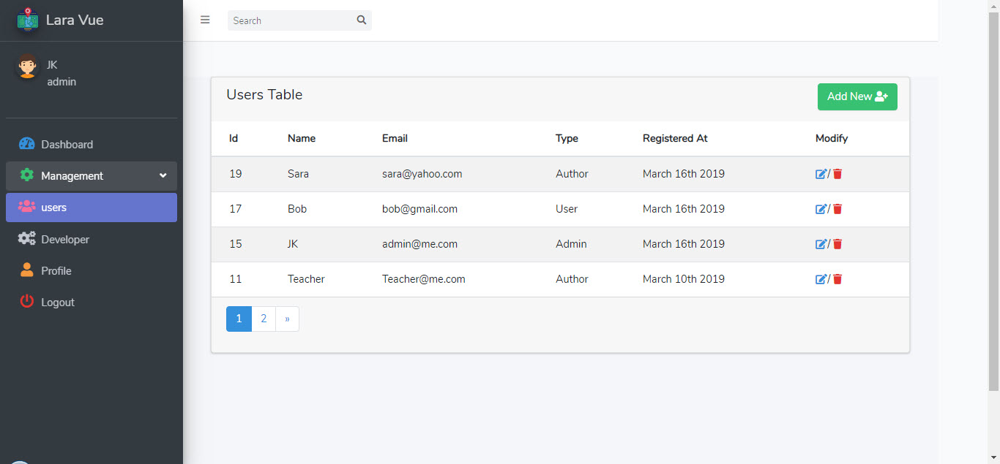

# Laravel Vue Admin Pannel
Starter Admin For Laravel.

  

  

<b> Here are the includes: </b>

* Vue Router with Laravel
* Install AdminLTE 3
* Use Font Awesome 5 on Laravel
* Use API in Laravel
* Api Auth with Laravel Passport
* JWT with Laravel Passport and JavaScript Request
* Vue Custom Events
* Vue form with Laravel
* Relational Database with Laravel
* Axios and Ajax Request
* ACL in Laravel

